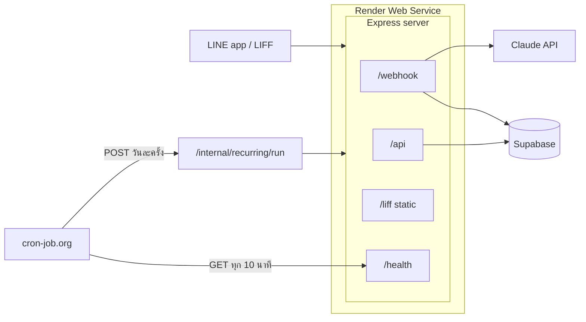

# line-expense-bot

LINE Official Account ที่บันทึกรายรับรายจ่ายจากข้อความภาษาธรรมชาติ (เช่น "กินข้าว 60 กาแฟ 45") โดยใช้ Claude แยกข้อความเป็นรายการ เก็บลง Supabase และมีเว็บ LIFF เปิดในแอป LINE สำหรับดู แก้ไข และวิเคราะห์ข้อมูล รองรับหลายผู้ใช้

## ความสามารถ

- **บันทึกด้วยข้อความ:** พิมพ์ภาษาธรรมชาติ ถ้ากำกวมบอทถามกลับสั้นๆ ก่อนบันทึก บอทตอบเป็นการ์ด (Flex Message) สรุปรายการที่บันทึก พร้อมปุ่ม "ยกเลิก" ท้ายการ์ด
- **แตะรายการในการ์ด:** เปิดหน้าเว็บที่ตัวแก้ไขของรายการนั้นทันที (ลิงก์ `?tx=<id>&d=<วันที่>`)
- **อ่านสลิป/ใบเสร็จ:** ส่งรูปให้บอทอ่านยอดรวมที่จ่ายจริง (ยอดสุทธิหลังส่วนลดของใบเสร็จ หรือยอดโอนของสลิป) เป็นรายการเดียว ไม่แยกสินค้า รายจ่ายลงหมวด "ใบเสร็จ/สลิปโอนเงิน" ส่วนสลิปที่ผู้ใช้เป็นฝ่ายรับเงินลงรายรับหมวด "อื่นๆ" โน้ตเป็นชื่อร้านหรือชื่อผู้รับ/ผู้โอน บอทตอบการ์ดพร้อมปุ่ม "บันทึก/ยกเลิก" และบันทึกจริงเมื่อกดยืนยัน ก่อนส่งให้ Claude บอทหมุนรูปตาม EXIF ย่อด้านยาวไม่เกิน 1568px และปรับความสว่าง/คอนทราสต์ ถ้าปรับรูปไม่สำเร็จจะใช้รูปเดิม
- **สรุปวัน/สัปดาห์/เดือน:** พิมพ์ `สรุปวันนี้` `สรุปสัปดาห์นี้` `สรุปเดือนนี้` (หรือ `สรุป` เพื่อเลือกช่วง) คำนวณยอดด้วย SQL แล้วส่งเป็นการ์ด
- **งบประมาณและการเตือน:** ตั้งงบต่อหมวด เตือนทุกครั้งที่บันทึกรายจ่ายแล้วยอดถึง 80% ของงบ (ใกล้เต็มงบ) หรือเกินงบ แสดงเป็นแถบสีในการ์ด
- **รายการประจำ:** บันทึกอัตโนมัติตามรอบเดือน จัดการผ่านหน้า LIFF และแจ้งใน LINE พร้อมปุ่มยกเลิก
- **เว็บ LIFF 5 แท็บ (ธีมสว่างอย่างเดียว):**
  - รายการ: ยอดคงเหลือเดือนนี้ ค้นหา/กรอง แก้ไข และลบ (แตะแถวเพื่อแก้ไข ปัดแถวไปทางซ้ายเพื่อเผยปุ่มลบ)
  - สรุป: กราฟตามหมวด แนวโน้ม 6 เดือน เทียบกับเดือนก่อน และ Export CSV
  - จัดการงบ: ตั้งงบต่อหมวดต่อเดือน
  - รอบเดือน: รายการประจำ
  - โปรไฟล์: ยอดเงินคงเหลือสะสม (รายรับรวม - รายจ่ายรวม ไม่ใช่ยอดบัญชีจริง) และรายชื่อเพื่อน (เพิ่มด้วยลิงก์ชวน รหัสเพื่อน 8 ตัว หรือ QR code) สำหรับหารบิล
- **Rich Menu** (สร้างเองใน LINE OA Manager ไม่อยู่ใน repo): ปุ่มสรุป / เปิดเว็บ (ลิงก์ LIFF) / ช่วยเหลือ

## สถาปัตยกรรม



| เส้นทาง | หน้าที่ |
| --- | --- |
| `POST /webhook` | รับ event จาก LINE (ตรวจ signature) |
| `/api/*` | API ของหน้า LIFF (ตรวจ ID token) |
| `/liff/` | ไฟล์ static ของหน้าเว็บ |
| `/exports/<token>` | ดาวน์โหลด CSV แบบลิงก์ใช้ครั้งเดียว |
| `POST /internal/recurring/run` | สร้างรายการประจำที่ถึงกำหนด (ต้องมี `Authorization: Bearer <CRON_SECRET>`) |
| `GET /health` | ตรวจสถานะ ใช้พิงกันเซิร์ฟเวอร์หลับ |

## Tech stack

- Node.js 22, Express 5
- LINE Messaging API, LIFF, `@line/bot-sdk`
- Claude API (`@anthropic-ai/sdk`) สำหรับแยกข้อความและอ่านสลิป
- `sharp` สำหรับปรับรูปสลิปก่อนส่ง Claude
- Supabase (Postgres) ผ่าน `@supabase/supabase-js`
- เว็บ LIFF เป็น HTML + ES module ธรรมดา ไม่มี build step
- vitest + jsdom สำหรับเทสต์, PGlite (Postgres ที่รันใน Node) สำหรับเทสต์ SQL function, ESLint, GitHub Actions (CI)
- Deploy: Render (Free plan) + cron-job.org

## โครงสร้างโฟลเดอร์

```
src/                        โค้ดฝั่ง server (bot, api, parser, slip, summary, budget, recurring, export, friends, db)
public/liff/                หน้าเว็บ LIFF และเทสต์ของหน้า
supabase/                   SQL schema และ migration (รันตามลำดับ)
scripts/                    สคริปต์ช่วยพัฒนา (try-parse)
docs/superpowers/plans/     แผนงานรายขั้น (รวมแผน deploy)
work-memory/STATE.md        บันทึกสถานะงานและ ticket ที่ค้าง
render.yaml                 ตั้งค่า Render (Blueprint)
.github/workflows/ci.yml    CI: lint, test, ตรวจ syntax
```

## การติดตั้งและรันในเครื่อง

1. ติดตั้ง dependency: `npm ci`
2. สร้างไฟล์ `.env` (ห้าม commit) ตามชื่อตัวแปรด้านล่าง ดูตัวอย่างชื่อใน `.env.example`

   | ตัวแปร | คำอธิบาย |
   | --- | --- |
   | `LINE_CHANNEL_SECRET` | channel secret ของ Messaging API ใช้ตรวจ signature |
   | `LINE_CHANNEL_ACCESS_TOKEN` | access token สำหรับตอบกลับและ push |
   | `ANTHROPIC_API_KEY` | API key ของ Claude |
   | `CLAUDE_MODEL` | (ไม่บังคับ) ชื่อโมเดล ถ้าไม่ตั้งใช้ค่าเริ่มต้นในโค้ด |
   | `SUPABASE_URL` | URL ของโปรเจกต์ Supabase (รูปแบบ `https://<ref>.supabase.co` ห้ามมี `/rest/v1/` ต่อท้าย) |
   | `SUPABASE_SERVICE_ROLE_KEY` | service role key ของ Supabase (ใช้ฝั่ง server เท่านั้น) |
   | `LIFF_ID` | LIFF ID ของหน้าเว็บ |
   | `LINE_LOGIN_CHANNEL_ID` | channel ID ของ LINE Login ใช้ verify ID token |
   | `CRON_SECRET` | secret ของ endpoint cron (ยาวอย่างน้อย 32 ตัวอักษร) |
   | `PORT` | (ไม่บังคับ) พอร์ตของ server ค่าเริ่มต้น 3000 |

3. รัน SQL ใน `supabase/` ที่ Supabase SQL Editor ตามลำดับ: `schema.sql` แล้ว `002` ถึง `012`
4. เริ่มเซิร์ฟเวอร์: `npm start`

การทดสอบกับ LINE จริงจากเครื่องต้องมี tunnel (เช่น ngrok) แล้วชี้ Webhook URL และ LIFF Endpoint URL ไปที่ tunnel ซึ่งจะทำให้บอทที่ deploy อยู่หยุดตอบระหว่างนั้น ถ้าต้องพัฒนาบ่อยแนะนำให้สร้าง LINE channel แยกสำหรับทดสอบ

## Deploy (Render)

บริการจริงรันบน Render (Free plan, Singapore) ตั้งค่าผ่าน `render.yaml` ขั้นตอนเต็มอยู่ที่ `docs/superpowers/plans/2026-10-02-deploy-render.md` สรุปคือ:

1. push โค้ดขึ้น GitHub (push เข้า `main` = deploy อัตโนมัติ ระหว่างนั้นบอทอาจไม่ตอบ 2-5 นาที)
2. สร้าง Blueprint บน Render จาก repo แล้วกรอกค่า secret 8 ตัว (ตัวแปรทั้งหมดในตารางด้านบนที่ไม่ใช่ `CLAUDE_MODEL` และ `PORT`) `render.yaml` ไม่เก็บค่า secret
3. ตั้ง Webhook URL ของ Messaging API เป็น `<URL ของ Render>/webhook` และ LIFF Endpoint URL เป็น `<URL ของ Render>/liff/`
4. ตั้ง cron-job.org 2 งาน:
   - `GET <URL>/health` ทุก 10 นาที (กัน Free plan หลับ)
   - `POST <URL>/internal/recurring/run` วันละครั้ง พร้อม header `Authorization: Bearer <CRON_SECRET>` (B ตัวใหญ่ เว้นวรรคเดียว) และเปิดแจ้งเตือนเมื่อล้มเหลว (timeout สูงสุดของ cron-job.org คือ 30 วินาที)
5. ใน LINE Developers console ของ LIFF app เปิด "shareTargetPicker" (ให้ปุ่มส่งลิงก์ชวนเพื่อนเปิดหน้าเลือกแชตได้ ถ้าไม่เปิด หน้าเว็บจะคัดลอกลิงก์แทน)
6. ใน LINE Developers console ของ LINE Login channel ที่ผูกกับ LIFF: ก่อนอื่นต้องผูก Official Account ของ Messaging API ที่ใช้กับบอท (ช่อง "Linked LINE Official Account" ใน Basic settings, ต้องอยู่ provider เดียวกัน) แล้วจึงตั้ง "Add friend option" (เลือกแบบ aggressive) ที่แท็บ LIFF ของ channel นั้น เพื่อให้ LINE ชวนเพิ่มบอทเป็นเพื่อนตอนเปิดหน้าเว็บ ผู้ใช้ที่เคยกดยอมรับสิทธิ์ของ LIFF app ไปแล้วจะไม่เห็นหน้าชวนนี้ ขั้นนี้ยังต้องยืนยันตอนทดสอบด้วยแอป LINE จริง (การตรวจว่าเพื่อนเพิ่มบอทแล้วจริงจะทำในเฟส 2 ตอนที่บอทต้องส่งข้อความหาเพื่อน)

## คำสั่งพัฒนา

- `npm test` รันเทสต์ทั้งหมด รวมเทสต์ SQL function ที่รัน migration ใน `supabase/` บน PGlite (ไม่ต้องต่อ Supabase หรือใช้ Docker)
- `npm run lint` ตรวจโค้ดด้วย ESLint
- `npm run try-parse` ลองแยกข้อความด้วย Claude จาก command line

CI (GitHub Actions) รัน lint, เทสต์ และตรวจ syntax ของ `index.js` กับ `public/liff/app.mjs` เมื่อ push เข้า `main` หรือเปิด pull request

## หมายเหตุความปลอดภัย

- ตรวจ LINE signature ของทุก webhook request
- หน้า LIFF ส่ง ID token ไปให้ server verify กับ LINE แล้วจึงอ้างอิงผู้ใช้
- เปิด RLS ทุกตาราง และ function ใน DB จำกัดให้ `service_role` เท่านั้น
- มี rate limit ข้อความและรูปที่ส่งเข้าบอท (10 ครั้ง/นาที/ผู้ใช้), `POST /api/exports` (5 ครั้ง/นาที/ผู้ใช้) และการค้นหา/เพิ่มเพื่อนด้วยรหัส (10 ครั้ง/นาที/ผู้ใช้ กันการเดารหัส) ข้อความที่ไม่เรียก Claude ไม่ถูกนับ ได้แก่ ปุ่มช่วยเหลือ ปุ่มเปิดเว็บ และ `สรุป` ที่แสดงเมนูเลือกช่วง
- endpoint cron `/internal/recurring/run` ป้องกันด้วย secret (`CRON_SECRET`) และตั้งใจไม่มี rate limit
- ค่า secret ทั้งหมดอยู่ใน `.env` (ในเครื่อง) หรือ environment ของ Render เท่านั้น ไม่อยู่ใน repo

## ข้อจำกัดที่ทราบ

- เพื่อนเห็นชื่อ LINE ของกันและกัน รหัสเพื่อนที่หลุดไปให้คนอื่นเปลี่ยนได้ในแท็บโปรไฟล์ (ลิงก์และ QR เดิมจะใช้ไม่ได้)
- Render Free plan หลับเมื่อไม่มี traffic 15 นาที (ใช้ cron-job.org พิง `/health` กันไว้ ยังไม่ยืนยันว่ากันได้ตลอด) และ Supabase Free อาจ pause โปรเจกต์ถ้าไม่มีการใช้งานหลายวัน
- ข้อความ push (รายการประจำ) นับโควตาของแพ็กเกจ LINE ส่วนข้อความตอบกลับ (reply) ไม่นับ
- ถ้า LINE ปฏิเสธการ์ด Flex ผู้ใช้จะไม่ได้ข้อความตอบ (ใช้ reply token ไปแล้ว ส่งซ้ำไม่ได้) รายการอาจถูกบันทึกไปแล้ว ดู log ของ Render
- ถ้าประมวลผลข้อความ รูป หรือการกดปุ่มใดเกิน 50 วินาที บอทตอบว่าระบบตอบช้ากว่าปกติแทนผลจริง แต่งานยังทำต่อ รายการจึงอาจถูกบันทึกหลังจากนั้น (ผู้ใช้ควรตรวจในหน้าเว็บก่อนส่งซ้ำ) LINE ไม่ระบุอายุของ reply token ที่แน่นอน ค่า 50 วินาทีเป็นค่าที่เลือกเผื่อไว้
- Export CSV อ่านทีละหน้าต่อจาก id ล่าสุด แถวที่ถูกแก้หรือลบระหว่าง export จึงไม่ทำให้แถวอื่นซ้ำหรือหาย แต่ไฟล์ไม่ได้มาจากจุดเวลาเดียวกันทั้งไฟล์ (แถวที่เพิ่มระหว่าง export อาจติดมาหรือไม่ก็ได้)
- เทสต์ SQL function รันบน PGlite ไม่ใช่ Supabase จริง: เรียงข้อความแบบ C collation (ลำดับชื่อภาษาไทยที่ขึ้นต้นด้วยสระหน้าต่างจาก Supabase) และ role ของ Supabase จำลองขึ้นในเทสต์
